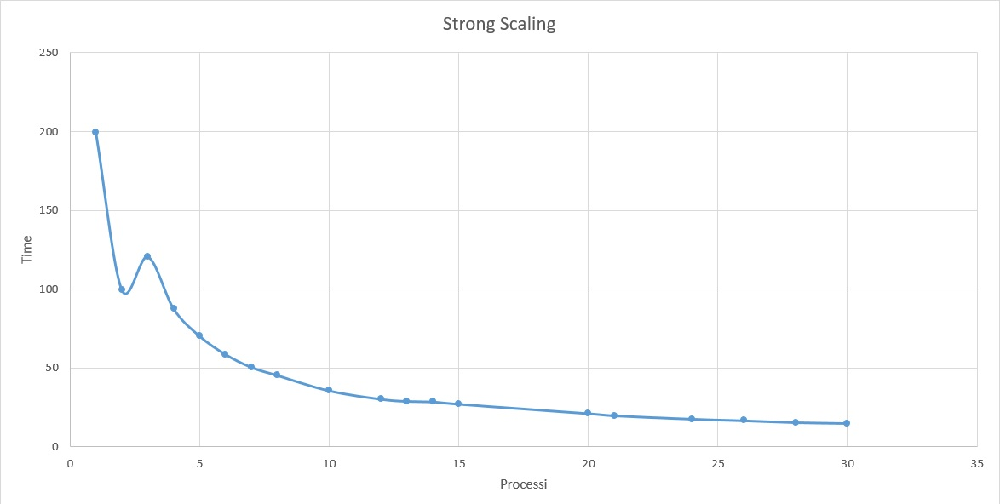
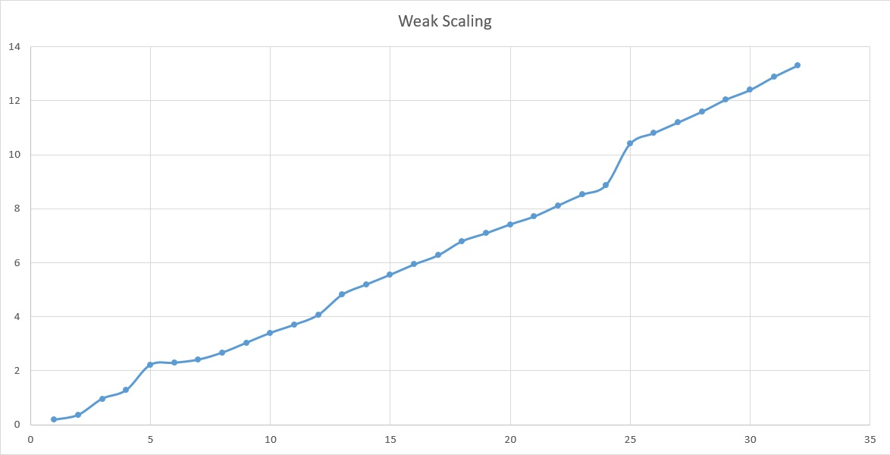

# Jacobi iteration

---

Il seguente documento è suddivo nelle seguenti sezioni:

 * Soluzione proposta 
 * Istruzioni per compilazione e esecuzione
 * Test sulla scalabilità
 * Conclusione


### Soluzione proposta

##### Input:
```
 np   : numero di processi
 N    : numero di righe della matrice quadrata (opzionale)
 flag : settato a 1 permette di stampare la sottomatrice generata da ogni processo (opzionale) 
```
##### Output:
```
 diffNorm  : la convergenza
 iteration : il numero di iterazioni eseguite
 time      : tempo di esecuzione
```
La soluzione proposta è articolata come segue :
 * **Prima parte (linea 1-78) :** la taglia N in input viene divisa per il numero np di processi, otteniamo così 
   il carico di lavoro per ogni processo. Successivamente ogni processo alloca la memoria in relazione al carico di lavoro e al propio numero di processo (il primo e ultimo processo hanno una riga in meno rispetto agli altri processi per il vincolo imposto dal problema) e genera la sua sottomatrice utilizzando numeri casuali 
   (dettagli specifici sulla generazion della matrice sono presenti nei commenti nel codice)
* **Seconda parte (linea 79-108) :** inizia l'iterazione e per prima cosa i processi iniziano scambiandosi le righe. Sia work la varibile che indica il numero di righe che gni processo deve computare , e size il numero di processi. Il processo con:
  * rank 0            : invia la riga work-1 al processo 1 (invia l'ultima riga che ha computato)
  * rank i con 1<=i< size-1 : invia la riga 1 e la riga work (invia la prima e l'ultima riga che ha computato)
  * rank size-1 : invia la riga 1 al processo con rank pari a size-2 (invia la prima riga che ha computato)
* **Terza parte (linea 109-135) :** ogni processo effettua le iterazioni sulla sua sottomatrice e calcola il diffNorm locale.
* **Quarta parte (linea 135-164) :** tutti i processi inviano il propio diffNorm al processo con rank 0 che ne effettua la somma e la distribusce ai tutti i processi che possono cosi procedere nell'iterazione
* **Quinta parte (linea 165-200) :** tutti i processi inviano un intero al processo con rank 0 cosi che siamo sicuri che tutti i processi sono terminati, ed infine viene deallocata la memoria.


### Istruzioni per compilazione e esecuzione

Compilazione :

```
  mpicc jacobj.c -o jacobj
```

Esecuzione :

```
  mpirun -np 4 --host MASTER,IP_SLAVE1,IP_SLAVE2 jacobj [numero_righe_matrice] [flag]
```

Senza i parametri opzionali viene generata una matrice di dimensione 12x12 ed essa non verra stampata in quanto il flag di default è 0,settandolo ad 1 verra mostrata la matrice generata su cui verrà eseguita la computazione.

Esempio:
```
  mpirun -np 4 --host 172.31.20.14 jacobj 4000
```
N.B. Il numero di righe (nell'esempio 4000) deve essere multiplo del numero di processi


### Test sulla scalabilità

I test sono stati eseguiti su una m4.xlarge con 4 core.
Di seguito sono riportati i grafici rispettivamente di Strong Scaling e Weak Scaling.



Nel test di Strong Scaling la taglia N di input è pari a 10920 e rimane costante durante tutto il test (matrice di dimensione 10920x10920).
Come si evince dal grafico l'esecuzione sequenziale prende tempo di circa 3,33 min, incrementando il numero di processi e di conseguenza il numero di instanze in relazione ai core il tempo diminuisce notevolmente.

I 19 test efettuati sono stati eseguiti utilizzando però solo un numero di processi multiplo della taglia in input.



Nel test di Weak Scaling la taglia N di input iniziale è 330.
In questo test la taglia varia in relazione al numero di processi mediante la seguente relazione :
**np * N**
  con np numero dei processi. 
### Conclusione
I test effettuati sono stati conformi alle aspettative tranne per qualche piccolo gap che parlando con il Dott. Carmine Spagnuolo sembra riconducibile all'utilizzo dell hyperthreading.
La macchina m4.xlarge utilizzava tale tecnlogia come riportato nelle specifiche https://aws.amazon.com/it/ec2/instance-types/. 
 
